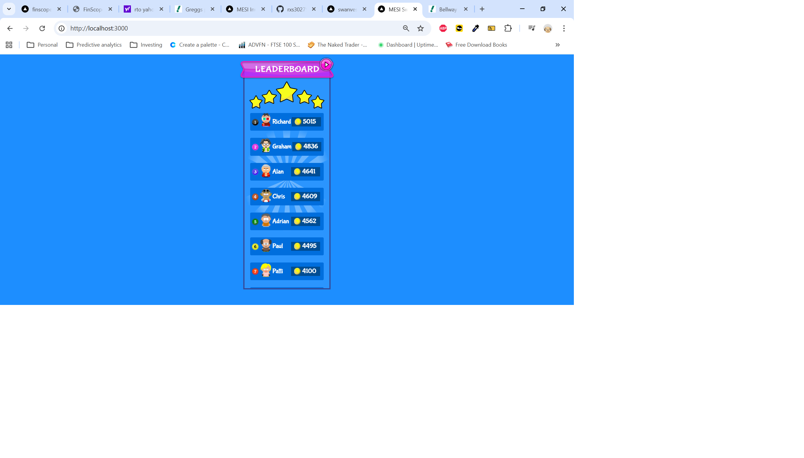

# MESI Investment Leaderboard

A real-time stock portfolio leaderboard for a private investment club. Members each hold a selection of LSE-listed stocks with a fixed notional investment, and the app ranks them by current portfolio value and monthly gain/loss.



## Features

- **Live leaderboard** — ranks all members by current total portfolio value, updated on every page load
- **Monthly change view** — shows each member's gain or loss over the past month
- **Stock drill-down** — click any member to see a breakdown of their individual holdings with a bar chart and a price table including 52-week high/low
- **Animated UI** — the current leader's avatar bounces, position markers and coin icons throughout

## Tech Stack

- [Next.js 13](https://nextjs.org/) (App Router, server components)
- [Recharts](https://recharts.org/) for bar charts
- [yahoo-finance2](https://github.com/gadicc/yahoo-finance2) for live LSE stock price data
- Deployed on [Vercel](https://vercel.com/)

## How It Works

Stock holdings are stored in [`src/app/components/data/investors.json`](src/app/components/data/investors.json). Each entry records the investor's name, the stock ticker, and a holding figure calculated from a fixed notional investment amount divided by the purchase price.

On each page load the server fetches live prices from Yahoo Finance, multiplies them against each investor's holdings, and sorts the results. No database — all state is derived fresh from the JSON file and the live API on every request.

## Getting Started

```bash
npm install
npm run dev
```

Open [http://localhost:3000](http://localhost:3000) to see the leaderboard.

The monthly change page is at [http://localhost:3000/month](http://localhost:3000/month).

## Project Structure

```
src/app/
├── page.js                  # Main leaderboard page
├── month/
│   └── page.js              # Monthly change page
└── components/
    ├── calculate.js          # Fetches quotes, calculates portfolio values
    ├── front_page.js         # Main leaderboard UI
    ├── front_page_month.js   # Monthly leaderboard UI
    ├── userPanels.js         # Scorecard rows
    ├── graph.js              # Stock drill-down (total value)
    ├── graphs_monthly.js     # Stock drill-down (monthly change)
    ├── chart.js              # Bar chart (total value)
    ├── chart_monthly.js      # Bar chart (monthly change)
    └── data/
        └── investors.json    # Member holdings
```
